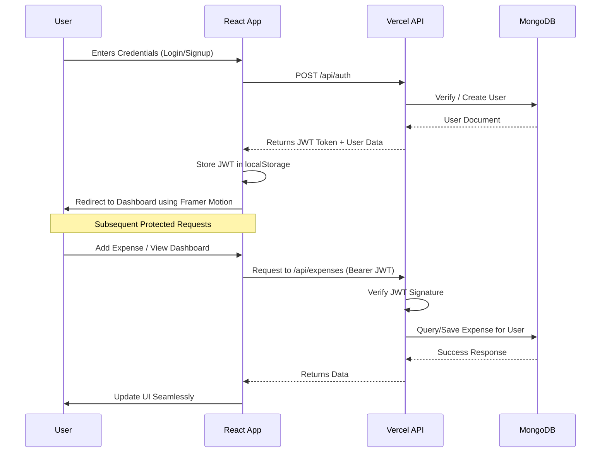

# 🚀 Vault - Premium Expense Tracker (Fintech SaaS)

An ultra-modern, glassmorphic expense management application built with a premium fintech SaaS aesthetic (inspired by Stripe, Linear, and Revolut). Demonstrates professional full-stack development practices, secure JWT authentication, and highly scalable Vercel Serverless API integration.


---

## ✨ Features

- **Ultra-Modern UI/UX**: Dark-mode glassmorphism theme, gradient background blobs, glowing interactive cards, and fluid page transitions using Framer Motion.
- **Serverless Backend**: Zero-config Vercel Serverless Functions (`api/` directory) for maximum scalability and low latency.
- **Secure Authentication**: JWT-based auth flow intercepting Axios requests and securely persisting state.
- **Database Integration**: Fully connected to a live MongoDB Atlas cloud database.
- **Smart Dashboard**: Real-time category breakdowns, dynamic filtering, sorting algorithms, and auto-updating balance cards.

---

## 🏗️ Architecture & Data Flow

### System Architecture

```mermaid
graph TD
    Client[Client Browser / User]
    Vercel[Vercel Edge Network]
    
    subgraph Frontend [React Application]
        AuthCtx[AuthContext Provider]
        Axios[Axios Interceptors]
        
        UI[Glassmorphic UI]
        Pages[Pages: Login, Signup, Dashboard]
        Components[Components: ExpenseList, BalanceCards]
        
        UI --> Pages
        Pages --> Components
        Components --> AuthCtx
        AuthCtx --> Axios
    End
    
    subgraph Backend [Vercel Serverless (api/)]
        API[expenses.js Endpoint]
        Utils[utils/ storage & validation]
        DB[MongoDB Connection Pool]
        
        API --> Utils
        Utils --> DB
    End
    
    MongoDB[(MongoDB Atlas)]
    
    Client -->|HTTPS Interactions| Frontend
    Axios -->|JSON API + JWT Token| Vercel
    Vercel --> API
    DB --> MongoDB
```

### Authentication & Request Flow



---

## 📂 Project Structure

```text
📦 Expense-Tracker
 ┣ 📂 api                      # Vercel Serverless Functions
 ┃ ┣ 📂 utils                  # Backend helpers & database logic
 ┃ ┃ ┣ 📜 helpers.js           # Shared calculation helpers
 ┃ ┃ ┣ 📜 storage.js           # MongoDB connection & schemas
 ┃ ┃ ┗ 📜 validation.js        # Input validation logic
 ┃ ┗ 📜 expenses.js            # Main Serverless API endpoints
 ┣ 📂 frontend                 # React Frontend Application
 ┃ ┣ 📂 public
 ┃ ┣ 📂 src
 ┃ ┃ ┣ 📂 components           # Lucide-React & Framer Motion Components
 ┃ ┃ ┃ ┣ 📂 dashboard          # Modular UI: BalanceCards, Sidebar
 ┃ ┃ ┃ ┣ 📜 ExpenseForm.js     # Floating animated form
 ┃ ┃ ┃ ┣ 📜 ExpenseList.js     # Animated list with category colors
 ┃ ┃ ┃ ┗ 📜 FilterSortBar.js
 ┃ ┃ ┣ 📂 context              # Global State
 ┃ ┃ ┃ ┗ 📜 AuthContext.js     # Context API for auth bridging
 ┃ ┃ ┣ 📂 pages                
 ┃ ┃ ┃ ┣ 📜 Login.js           # Premium animated login
 ┃ ┃ ┃ ┣ 📜 Signup.js          # Premium animated signup
 ┃ ┃ ┃ ┗ 📜 Dashboard.js       # Main authenticated route
 ┃ ┃ ┣ 📜 api.js               # Global Axios config and interceptors
 ┃ ┃ ┣ 📜 App.js               # Router logic
 ┃ ┃ ┣ 📜 index.js
 ┃ ┃ ┗ 📜 index.css            # Tailwind directives & Glass CSS
 ┃ ┣ 📜 package.json
 ┃ ┗ 📜 tailwind.config.js     # Deep custom theme configuration
 ┣ 📜 vercel.json              # Vercel API routing parameters
 ┗ 📜 README.md
```

---

## 🚀 Quick Setup & Deployment

### Local Development

1. **Install Frontend Dependencies:**
   ```bash
   cd frontend
   npm install
   ```

2. **Environment Variables:**
   Create a `.env` file in the root if running the backend locally, or rely on Vercel CLI:
   ```env
   MONGODB_URI=mongodb+srv://<user>:<password>@cluster.mongodb.net/vault
   JWT_SECRET=your_super_secret_key
   ```

3. **Run App:**
   Start the React app (Expects backend running or pointing to remote Vercel API via `REACT_APP_API_URL`):
   ```bash
   npm start
   ```

### Vercel Deployment

This project is built explicitly for Vercel Serverless architecture.

1. **Push to GitHub / GitLab**.
2. **Connect Repository to Vercel**.
3. Vercel will automatically detect `frontend` React app and root `api/` endpoints based on `vercel.json`.
4. Add Environment Variables (`MONGODB_URI`, `JWT_SECRET`) in Vercel Dashboard.
5. Deploy.

---

## 💻 Tech Stack

- **Frontend**: React 18, React Router DOM v6
- **Styling**: Tailwind CSS v3, Framer Motion, Lucide React Icons
- **HTTP/Networking**: Axios with centralized interceptors
- **Backend / API**: Vercel Serverless Functions (`api/*` routing)
- **Database**: MongoDB Atlas via native MongoDB driver integration
- **Security**: JWT tokens, bcrypt hashed passwords in Mongo mapping

---

## 🔐 Security & Best Practices

- Token storage uses secure API interceptors pointing to Authorization Headers.
- Vercel handles SSL/TLS routing out of the box.
- MongoDB Atlas clustered with Network Access limited limits.
- UI features completely stateless functional implementations decoupled from data logic.
